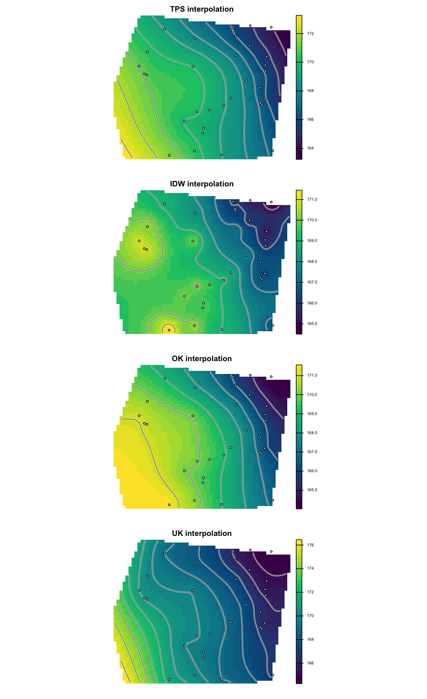
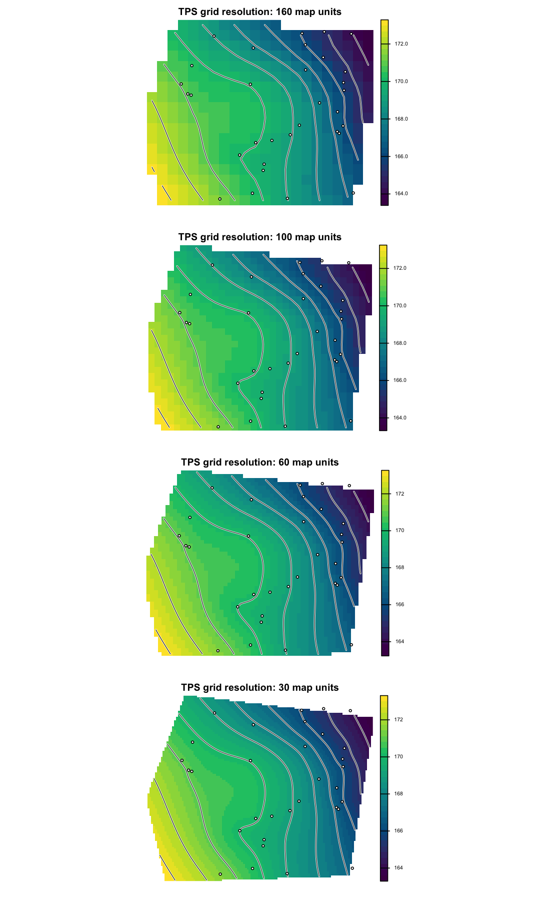
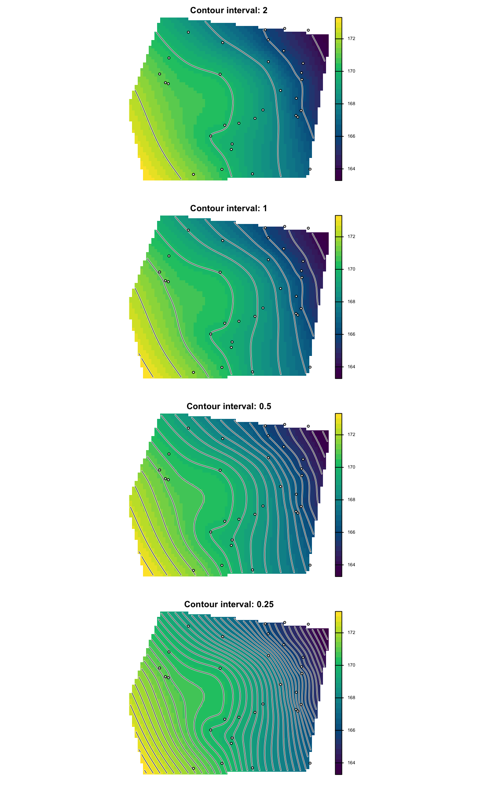
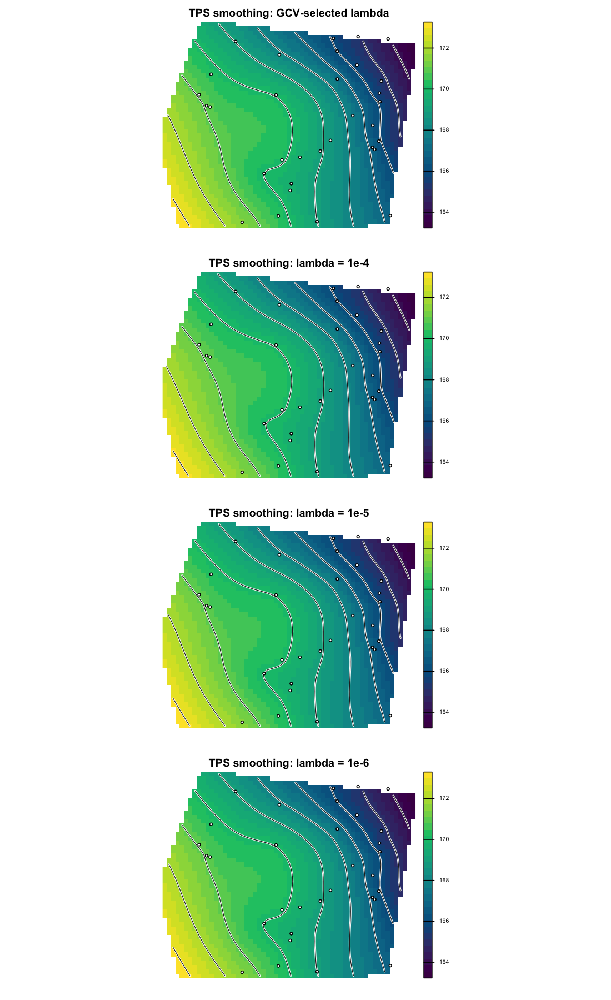
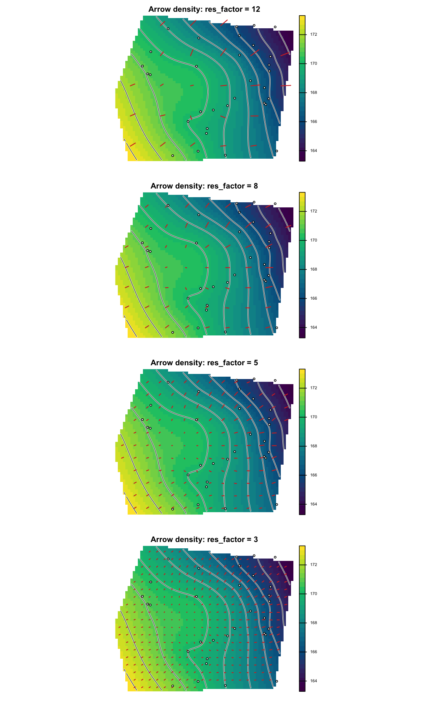
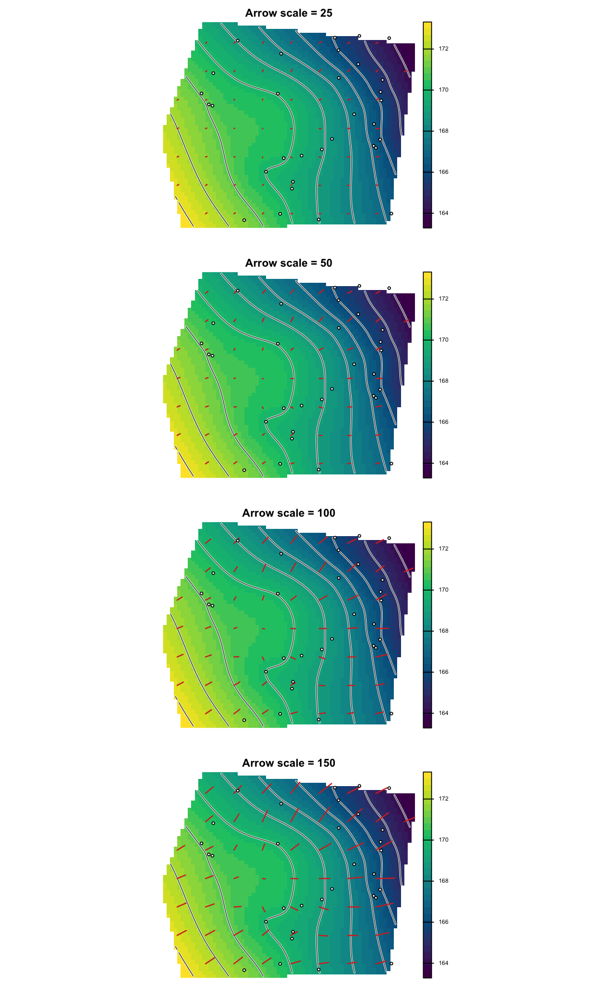

# potentiomap

`potentiomap` builds potentiometric surface products from groundwater monitoring
data. It prepares groundwater elevation observations from direct water-level
measurements or depth-to-water measurements, interpolates a continuous
potentiometric surface, generates contour products, and derives hydraulic
gradient flow arrows suitable for GIS review and technical reporting.

The default interpolation method is a thin-plate spline (`TPS`), which provides
a smooth surface appropriate for many monitoring-well networks. Additional
built-in methods include inverse distance weighting (`IDW`), ordinary kriging
(`OK`), and universal kriging (`UK`). Advanced users can also supply their own
interpolation function.

## Installation

Install the released version:

```r
install.packages("potentiomap")
```

Install the development version:

```r
install.packages("remotes")
remotes::install_github("el-cordero/potentiomap")
```

Load the package:

```r
library(potentiomap)
library(terra)
```

## Core Workflow

`potentiomap` organizes a groundwater surface workflow into four stages:

1. Prepare monitoring points with a standardized groundwater elevation field.
2. Interpolate a potentiometric surface on a raster grid.
3. Export surface, contour, and quicklook products.
4. Generate hydraulic-gradient arrows and arrow-tip or arrow-base point layers.

The package accepts coordinate tables, `sf` objects, and `terra::SpatVector`
point layers. Tabular inputs require coordinate columns and a coordinate
reference system.

## Example Data

The package includes synthetic example data for reproducible examples:

- `synthetic_wells`: monitoring-well coordinates, land-surface elevations,
  depth-to-water measurements, and groundwater elevations.
- `synthetic_dem`: a packed `terra` raster representing land-surface elevation.
- `synthetic_surface_points`: separate land-surface elevation measurements.
- `ps_sample_aoi()`: an example area-of-interest polygon.

```r
data("synthetic_wells")
data("synthetic_dem")
data("synthetic_surface_points")

synthetic_dem <- terra::rast(synthetic_dem)
```

## Preparing Groundwater Elevation Points

### Direct Groundwater Elevation Measurements

Use `ps_make_points()` when groundwater elevation is already present in the
input table.

```r
gw_points <- ps_make_points(
  synthetic_wells,
  x = "x",
  y = "y",
  value = "gw_elevation",
  name_col = "well_id",
  crs = "EPSG:26916"
)
```

The returned point layer contains standardized `Z` and `Name` fields. `Z` is the
groundwater elevation used by the interpolation functions.

### Depth to Water with a DEM

Use `ps_potentiometric_points()` when field data contain depth to water and
land-surface elevation should be sampled from a DEM.

```r
gw_points <- ps_potentiometric_points(
  synthetic_wells,
  x = "x",
  y = "y",
  depth_col = "depth_to_water",
  surface = synthetic_dem,
  name_col = "well_id",
  crs = "EPSG:26916"
)
```

### Depth to Water with a Surface-Elevation Column

If the well table already contains land-surface elevation, provide that column
through `surface_col`.

```r
gw_points <- ps_potentiometric_points(
  synthetic_wells,
  x = "x",
  y = "y",
  depth_col = "depth_to_water",
  surface_col = "surface_elevation",
  name_col = "well_id",
  crs = "EPSG:26916"
)
```

### Depth to Water with Separate Surface Points

Separate land-surface elevation points can also be used. Matching names are used
when available; otherwise the surface elevation points are interpolated to the
groundwater measurement locations.

```r
gw_points <- ps_potentiometric_points(
  synthetic_wells,
  x = "x",
  y = "y",
  depth_col = "depth_to_water",
  surface = synthetic_surface_points,
  surface_col = "surface_elevation",
  name_col = "well_id",
  surface_name_col = "point_id",
  crs = "EPSG:26916"
)
```

## Interpolation

The default call uses thin-plate spline interpolation.

```r
tps_surface <- ps_interpolate(
  gw_points,
  grid_res = 50,
  mask = ps_sample_aoi()
)

names(tps_surface)
```

Run multiple built-in methods by passing `methods`.

```r
surfaces <- ps_interpolate(
  gw_points,
  methods = c("TPS", "IDW", "OK", "UK"),
  grid_res = 50,
  mask = ps_sample_aoi(),
  padding = 150
)
```

### Custom Interpolation Methods

Custom methods receive the prepared point layer, the template raster, and the
prediction grid. They must return either a `terra::SpatRaster` matching the
template or a numeric vector with one value per template cell.

```r
mean_surface <- function(points, template, grid) {
  rep(mean(terra::values(points)$Z), terra::ncell(template))
}

custom_surface <- ps_interpolate(
  gw_points,
  methods = "mean_surface",
  custom_methods = list(mean_surface = mean_surface),
  grid_res = 50,
  mask = ps_sample_aoi()
)
```

## Exporting Surface Products

`ps_export_surfaces()` writes GeoTIFF surfaces, contour shapefiles, and quicklook
PNG figures.

```r
out_dir <- file.path(tempdir(), "potentiomap-products")

outputs <- ps_export_surfaces(
  surfaces,
  points = gw_points,
  out_dir = out_dir,
  out_stub = "synthetic",
  contour_interval = 1
)

outputs
```

The output table lists the raster, contour, and quicklook file paths for each
interpolation method.

## Hydraulic Gradient and Flow Arrows

`ps_flow_arrows()` calculates slope and aspect from a potentiometric surface,
converts slope to hydraulic gradient, samples the gradient to a readable arrow
spacing, and builds downgradient line features.

```r
flow <- ps_flow_arrows(
  surfaces$TPS,
  res_factor = 8,
  scale = 80,
  out_dir = out_dir,
  out_stub = "synthetic_TPS"
)

tips <- ps_arrow_vertices(
  flow$arrows,
  which = "last",
  out_file = file.path(out_dir, "synthetic_TPS_arrow_tips.shp")
)

bases <- ps_arrow_vertices(
  flow$arrows,
  which = "first",
  out_file = file.path(out_dir, "synthetic_TPS_arrow_bases.shp")
)
```

The flow output includes a hydraulic-gradient raster, sampled gradient points,
arrow lines, arrow tips, and arrow bases.

## Visual Examples

The following panels are generated from the bundled synthetic dataset. Each
figure uses four rows to show how an output changes as one modeling or display
choice varies.

### Interpolation Method

TPS is the default method. IDW, OK, and UK are available when comparison among
surface assumptions is useful.



### Grid Resolution

Smaller grid cells preserve more local detail but create larger output rasters.
Coarser grids are faster and may be appropriate for broad screening maps.



### Contour Interval

Contour interval controls how much vertical detail is shown. Fine intervals can
highlight subtle gradients; wider intervals can make regional patterns easier to
read.



### TPS Smoothing

TPS smoothing can be selected automatically by generalized cross-validation or
specified directly through `tps_lambda`.



### Arrow Density

`res_factor` controls the spacing of sampled hydraulic-gradient arrows. Higher
values create fewer arrows; lower values create denser arrow fields.



### Arrow Scale

`scale` controls arrow length. Larger values emphasize small gradients; smaller
values reduce visual clutter.



## Choosing a Method

TPS is a practical default for producing smooth potentiometric surfaces from
typical monitoring-well datasets. IDW is deterministic and easy to interpret.
Kriging methods can be valuable when the observation network supports a
meaningful variogram model, but sparse monitoring networks may produce
variogram-fit warnings. Those warnings should be reviewed as part of model
selection rather than suppressed automatically.

## References

Hijmans, R. J. (2025). `terra`: Spatial Data Analysis. R package version 1.9-1.

Nychka, D., Furrer, R., Paige, J., and Sain, S. (2021). `fields`: Tools for
spatial data.

Pebesma, E. (2018). Simple Features for R: Standardized Support for Spatial
Vector Data. *The R Journal*, 10(1), 439-446.

Pebesma, E. (2004). Multivariable geostatistics in S: the `gstat` package.
*Computers & Geosciences*, 30, 683-691.
